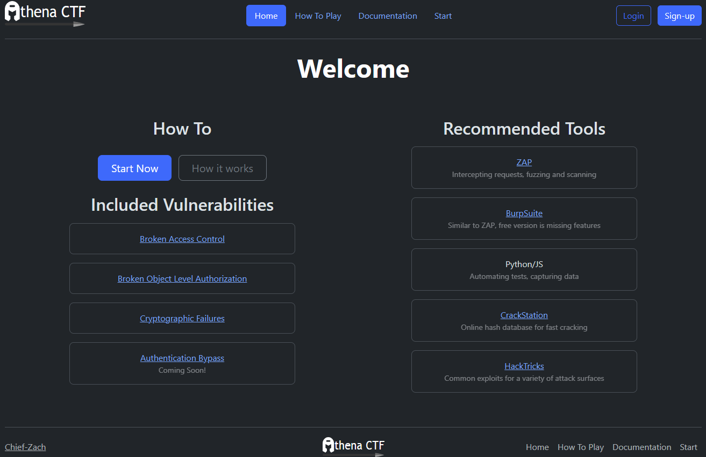

<p align="center">
  
</p>


# Athena CTF - Open Source CTF Builder

<div align="center">


</div>

Athena CTF is an open source tool allowing security researchers, experienced and inexperienced, the ability to create, share, and exploit their own capture the flag web challenges. Through a modular approach, levels can be created with as little as 5 lines of code, using Jinja templating, and a preconfigured FastAPI backend. Including plugins for AI assisted hints based on past submissions. 



## ✨Features

- 🧱**Modular Design**: Premade classes and helper functions allow for the creation of fully fledged levels in less than 5 lines of code
- ⛓️**Asyncio Support**: Create your own routes, with your own templates in an async or static context. Provide instructions as text, or create your own custom static, or async function.
- 🤖**Customized LLM Provided Hints**: Use the provided classes to spawn and connect MongoDB collections allowing for the tracking of user progress, LLM provided hints through custom prompts and past user attempts.
- ☑️**Premade Levels**: 15 premade levels with increasing difficulty targeting each of the [OWASP Top 10](https://owasp.org/www-project-top-ten/)

### Level Creation
The code block below shows the method of creating a level with just a few lines of code. 
```python
from app.utils.page import Page

game_class = Page("Example Game", instructions="Example",
             verify=lambda x: {"success": True}
             if x else {"success": False})
game = game_class.route
```
More complex verify functions can be created, both async and static:
```python
async def verify(request: Request):
    try:
        headers = request.headers
        cookie = request.cookies.get("cookie", None)
    except json.decoder.JSONDecodeError:
        return {"success": False, "error": {"code": 403, "text": "Unauthorized"}}

    if cookie is None:
        return {"success": False, "error": {"code": 403, "text": "Unauthorized"}}

    _, prepended, appended = get_page(request.cookies.get("cookie"))


    user_code = headers.get("Authorization", None)

    if generate_user_code(prepended, appended) == user_code:
        return {"success": True}

    else:
        return {"success": False, "error": {"code": 403, "text": "Unauthorized"}}

game_class = Page("Example Game", verify=verify)
```
Instructions and verification functions can also be passed to the class later using game_class.set_functions():

```python
instructions = "These are my instructions!"
# OR
async def instructions(request: Request):
    print(request.headers)
    text = ("These are my instructions!")
    subtext = "Note: This is some subtext"
    print(f"URL: {config.URL}{game_class.url_prefix}/frontend")
    button = generate_button("View Order", f"{config.URL}{game_class.url_prefix}/frontend")

    response = templates.TemplateResponse(request=request, name=config.TEMPLATE, context={"header": game_class.name,
                                            "text": text, "subtext": subtext, "primary_button": button})
    
game_class.set_functions(instructions=instructions)
```

From there, you can create your own routes that interact with preset routes such as instructions and verify, or create your own custom web application.
```python
from fastapi import Request, Response
from fastapi.responses import JSONResponse

@game.post('/super_secure_request', response_class=Response)
async def time_hashing(request: Request):
    try:
        data = await request.json()
    except json.decoder.JSONDecodeError:
        resp = Response("Permission Denied")
        resp.status_code = 403
        return resp

    if valid_hash(data):
        return JSONResponse(f"Successfully posted image
        {data['imagePath']} to {data['userID']}'s feed!")

    else:
        resp = Response("Permission Denied")
        resp.status_code = 403
        return resp
```
For more information visit:
# [Creating Levels](wiki/Home.md)

Helmet vector in logo by <a href="https://github.com/neuicons/neu?ref=svgrepo.com" target="_blank">Neuicons</a> in MIT License via <a href="https://www.svgrepo.com/" target="_blank">SVG Repo</a>
